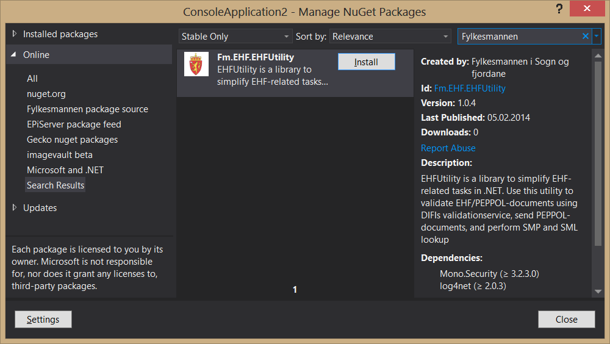
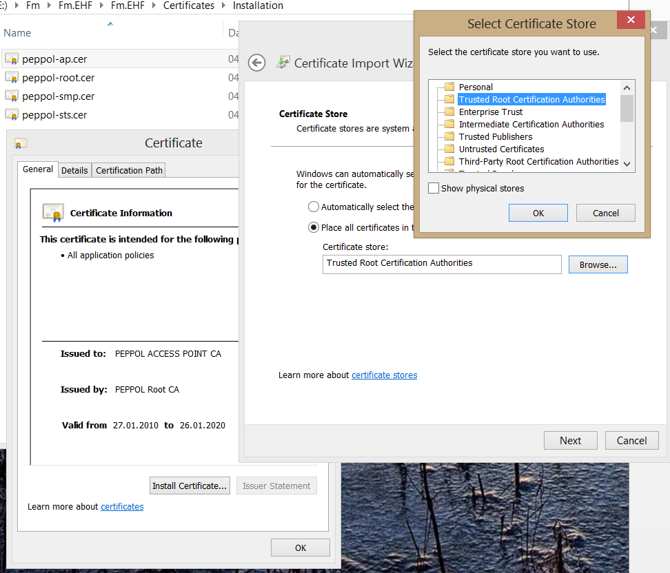
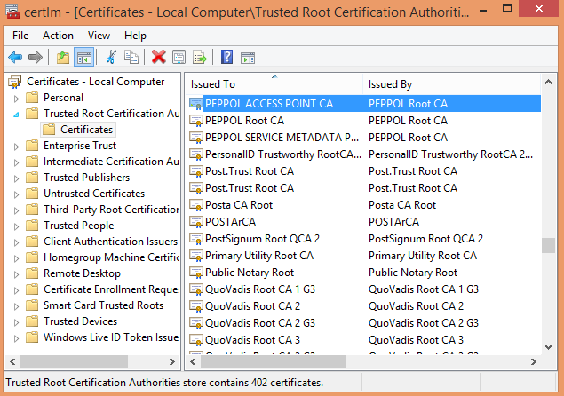

#EHFUtility

EHFUtility is a .NET-library to simplify EHF-related tasks in .NET. Use this utility to:
- Validate EHF-documents using DIFIs validationservice
- Send EHF-documents 
- Perform SMP and SML lookup

What you can’t do with this library:
- Receive PEPPOL-documents ([Oxalis] (https://github.com/difi/oxalis) is a complete access point which can receive documents and send documents (java-lib or command-line))
- Generate EHF-xml. If you want to generate .NET-classes for EHF-Invoice: download XSD-schemas from DIFIs VEFaValidator-tool and use Xsd2Code or other tool

EHFUtility uses a modified version of PEPPOLs [START-library] (https://joinup.ec.europa.eu/svn/peppol/dev/infrastructure/sample_implementations/dotnet/start/) (upgraded from .NET 3.5 to 4.5) to send PEPPOL documents. Validation is performed using DIFIs validationservice [VEFA validator](https://github.com/difi/VEFAvalidatorApp) which is being developed by [Difi](http://vefa.difi.no).

##Usage

```c#
var xml = new XmlDocument();
xml.Load(@"SampleData\sampleinvoice.xml");
var ehfUtility = new EHFUtility();

//To validate document using DIFIs validationservice:
ValidationResult validationResult = ehfUtility.ValidateDocument(xml);

//Lookup service metadata:
SmpInformation lookupFm = ehfUtility.LookupSMP("9908:974763907");            

//Send invoice:
SendResult sendResult = ehfUtility.SendDocument(xml, "9908:453463465", "9908:974763907");
```


##Installation 
1. Add NuGet-package
2. Install PEPPOL root certificates into trusted root certification authorities
3. Create keystore with your private key and certificate issued by PEPPOL
4. Modify app.config/web.config

###Add NuGet-package



Right click project/solution->Manage NuGet-packages->nuget.org->search for «EHF» or «Fylkesmannen»->Install.
This package is built and updated automatically on changes in git.

The NuGet-package adds a "Certificates"-folder and "SampleData"-folder. Change setting Copy to output directory = Copy if newer:

![screenshot copy] (Documentation/screenshotCopy.PNG)

###Install PEPPOL root certificates
Root-certificates from PEPPOL has to be installed in trusted root certification authorities for certificate-validation to work properly. Root-certificates can be found in the Certificates\Installation\-folder that came with the NuGet-package, or you can download root certificates directly from PEPPOL here:
- https://onsite.verisign.com/services/DigitaliseringsstyrelsenOpenPEPPOLSECURITYTOKENSERVICECA/digitalidCenter.htm
- https://onsite.verisign.com/services/DigitaliseringsstyrelsenOpenPEPPOLACCESSPOINTCA/digitalidCenter.htm
- https://onsite.verisign.com/services/DigitaliseringsstyrelsenOpenPEPPOLSERVICEMETADATAPUBLISHERCA/digitalidCenter.htm

Install all root certificates from PEPPOL to Local machine->Trusted Root Certification Authorities



###Install your own certificate
You need to obtain a certificate from PEPPOL identifying you to other PEPPOL-services. Look [here] (http://www.peppol.eu/) and [here] (http://anskaffelser.no/e-handel) for more information.

1. Download KeyStore Explorer from http://keystore-explorer.sourceforge.net/downloads.php. (or use other tools) 
2. Create new keystore->PKCS #12->Save as «Certificates\privateKeystore.pfx». Enter a password  «changeit» (or something else). 
3. Generate your private key and certificate signing request:
    1. Right click->generate Key Pair->RSA 2048->fill in information
    2. Right click key pair->generate CSR (certificate signing request)
    3. Upload request.CSR to PEPPOL, get your certificate in return «reply from peppol.p7r»
    4. Right click key pair->Import CA reply
    
    
Your privateKeystore.pfx and certificate from PEPPOL should look like this (It should only contain one entry! If you have two entries you did it wrong):

![screenshot PrivateKey] (Documentation/screenshotPrivateKey.png)

###Modify app.config/web.config
The NuGet-package adds a config-section automatically:

```xml
<?xml version="1.0" encoding="utf-8"?>
<configuration>
  <configSections>
    <section name="peppol.certificates" type="STARTLibrary.src.eu.peppol.start.security.configuration.CertificatesConfigurationSection, STARTLibrary45" />    
  </configSections>
```

Configure password to your keystore in app.config:

```xml
<clientCertificate filename="Certificates\privateKeystore.pfx" password="changeit" />
```
  
If you are using test-certificates in stead of live you have to change thumbprints used for validation:

```xml
      <add name="MyRootCertificates"
           rootCACertificateThumbprint="C55F371D9B3C3A54A06FD51E02E43F9E90F6D65C"
           intermediateSmpCACertificateThumbprint="9C200AB2044F67BA89D9ADE2180CCDE878639470"
           intermediateAcessPointCACertificateThumbprint="696D7543E15F84A32A1121531D0551BCB3AAEA50" />
    </validation>
```

Use the same endpointname in the peppol.certificates-section, WCF-configuration(system.servicemodel->client->endpoint->name) and when creating your EHFUtility-instance. 

```xml
    <clientCredentials>      
      <add endpointName="SecurePeppolClient">        
```

If you are testing against a specific endpoint/access point, fill in that servers public key in the serviceCertificate-element:

```xml
             <serviceCertificate encoded="Msdfsdfr+naizO3DANBgkqhkiG9w0BAQsFADBX&#xD;&#xA;MQswCQYDVQQGEwJESzEnMCUGA1UEChMasdfdfUwgSVQgQU5EIFRFTEVDT00g&#xD;&#xA;QUdFTkNZMR8wHQYDVQQDExZQRVBQT0wgQUNDRVNTIFBPSU5UIENBMB4XDTE0MDEw&#xD;&#xA;ODAwMDAfgfDTE2MDEwODIzNTk1OVowUDELMAkGA1UEBhMCTk8xFzAVBgNVBAMM&#xD;&#xA;DkFQsdfDAwMDAwMDY0MSgwJgYDVQQKDB9GeWxrZXNtYW5uZW4gaSBTb2duIG9n&#xD;&#xA;IEZqb3JkYW5lMIIBIjANBgkqhkiG9w0BAQEFAAOCAQ8AMIIBCgKCAQEAqNLdts3A&#xD;&#xA;xyYW98n-REMOVED-&#xD;&#xA;BgNVHQ4EFgQULr75Ch041QO4LsB0aNwUczyYrXowNwYIKwsdfAQEEKzApMCcG&#xD;&#xA;CCsGAQUFBzABhhtodHRwOi8vcGtpLW9jc3Auc3ltYXV0aC5jb20wEwYDVR0lBAww&#xD;&#xA;CgYIKwYBBQUHAwIwDQYJKoZIhvcNAQELBQADggEBAIAI5Y2TD1Ld61XzCHpRWbQL&#xD;&#xA;1rBiP0okp3KBugtdfUJJ76UArUDwajsSMRetPYmRNgZYY1ix2FfPcJ4wBJf4i85d&#xD;&#xA;jXSJUsjQmqbZ0LBoUqYrxGJdbK0Gjn38zwm4z3ucjKHMjTIn3cRE9TS74q2RakNw&#xD;&#xA;nA1gjiNKKXtBN2VIHXUHRzDKZ6Hd42XhJgj477rwn92U0LOlZU3sLgmSLqs5GCbF&#xD;&#hghVri40NcliDCre3bQe2cUy26fdd6FnC2Z1S2sZ9wFQ7tuWjG6cdfJ301Pdjh7RV&#xD;&#xA;wOzV1+VsORHVh8rgJKWkgVsDErunJVwEPeDeIL0KxUR0BvLU3ygwQR3HaW6iXmQ="/>
      </add>
    </clientCredentials>
  </peppol.certificates>
```

####Complete app.config sample:
```xml
<?xml version="1.0" encoding="utf-8"?>
<configuration>
  <configSections>
    <section name="peppol.certificates" type="STARTLibrary.src.eu.peppol.start.security.configuration.CertificatesConfigurationSection, STARTLibrary45" />    
  </configSections>
  <system.diagnostics>
    <sources>
      <source name="System.ServiceModel.MessageLogging" switchValue="Warning,ActivityTracing">
        <listeners>
          <add type="System.Diagnostics.DefaultTraceListener" name="Default">
            <filter type="" />
          </add>
          <add name="ServiceModelMessageLoggingListener">
            <filter type="" />
          </add>
        </listeners>
      </source>
      <source propagateActivity="true" name="System.ServiceModel" switchValue="Warning,ActivityTracing">
        <listeners>
          <add type="System.Diagnostics.DefaultTraceListener" name="Default">
            <filter type="" />
          </add>
          <add name="ServiceModelTraceListener">
            <filter type="" />
          </add>
        </listeners>
      </source>
    </sources>
    <sharedListeners>
      <add initializeData="e:\app_messages.svclog"
        type="System.Diagnostics.XmlWriterTraceListener, System, Version=4.0.0.0, Culture=neutral, PublicKeyToken=b77a5c561934e089"
        name="ServiceModelMessageLoggingListener" traceOutputOptions="Timestamp">
        <filter type="" />
      </add>
      <add initializeData="e:\app_tracelog.svclog"
        type="System.Diagnostics.XmlWriterTraceListener, System, Version=4.0.0.0, Culture=neutral, PublicKeyToken=b77a5c561934e089"
        name="ServiceModelTraceListener" traceOutputOptions="Timestamp">
        <filter type="" />
      </add>
    </sharedListeners>
  </system.diagnostics>
  <startup>
    <supportedRuntime version="v4.0" sku=".NETFramework,Version=v4.5"/>
  </startup>
  <system.serviceModel>
      <diagnostics>
          <messageLogging logEntireMessage="true" logMalformedMessages="true"
              logMessagesAtTransportLevel="true" />
      </diagnostics>
      <behaviors>
          <endpointBehaviors>
              <behavior name="PeppolClientBehavior" />
          </endpointBehaviors>
      </behaviors>
      <bindings>
          <customBinding>
              <binding name="CusomSecureBinding" closeTimeout="00:02:00" openTimeout="00:02:00"
                  sendTimeout="00:10:00">
                  <reliableSession flowControlEnabled="false" reliableMessagingVersion="WSReliableMessaging11" />
                  <security defaultAlgorithmSuite="Basic128" allowSerializedSigningTokenOnReply="true"
                      enableUnsecuredResponse="false" authenticationMode="MutualCertificateDuplex"
                      requireDerivedKeys="false" securityHeaderLayout="Lax" allowInsecureTransport="false"
                      messageProtectionOrder="SignBeforeEncrypt" messageSecurityVersion="WSSecurity10WSTrust13WSSecureConversation13WSSecurityPolicy12BasicSecurityProfile10" />
                  <mtomMessageEncoding messageVersion="Soap11WSAddressing10" maxBufferSize="2147483647">
                      <readerQuotas maxDepth="2147483647" maxStringContentLength="2147483647"
                          maxArrayLength="2147483647" maxBytesPerRead="2147483647" maxNameTableCharCount="2147483647" />
                  </mtomMessageEncoding>
                  <httpsTransport maxBufferPoolSize="2147483647" maxReceivedMessageSize="2147483647"
                      hostNameComparisonMode="WeakWildcard" maxBufferSize="2147483647" />
              </binding>
          </customBinding>
      </bindings>
      <client>
          <endpoint address="https://yourdomain.com/oxalis/accessPointService"
              behaviorConfiguration="PeppolClientBehavior" binding="customBinding"
              bindingConfiguration="CusomSecureBinding" contract="accesspointService.Resource"
              name="SecurePeppolClient" kind="" endpointConfiguration="" />
      </client>
  </system.serviceModel>
  
  <peppol.certificates>
    <validation>
      <!-- Thumbprints for:         
            - PEPPOL Root TEST CA
            - PEPPOL SERVICE METADATA PUBLISHER TEST CA
            - PEPPOL ACCESS POINT TEST CA 
            -->
      <add name="MyRootCertificates"
           rootCACertificateThumbprint="C55F371D9B3C3A54A06FD51E02E43F9E90F6D65C"
           intermediateSmpCACertificateThumbprint="9C200AB2044F67BA89D9ADE2180CCDE878639470"
           intermediateAcessPointCACertificateThumbprint="696D7543E15F84A32A1121531D0551BCB3AAEA50" />
    </validation>
    <serviceCredentials>
      <add serviceName="SecurePeppolClient">
        <!-- truststore inneheld alle root-sertifikat fra PEPPOL. -->
        <serviceCertificate filename="Certificates\truststore-production.pfx" password="peppol" />
      </add>
    </serviceCredentials>
    <clientCredentials>      
      <add endpointName="SecurePeppolClient">        
        <!-- clientCertificate her identifiserer klienten overfor andre aksesspunkt. Vi trenger private key og virksomheten sitt sertifikat fra PEPPOL for å signere meldinger + identifisere klient-->
        <clientCertificate filename="Certificates\privateKeystore.pfx" password="changeit" />

        <!-- serviceCertificate her identifiserer servicen/aksesspunktet vi snakker med. Sertifikatet her brukes mot aksesspunkt/endpoint konfigurert i WCF-konfigurasjon. Når vi snakker med andre aksesspunkt laster vi ned public key fra peppol sin SML eller SMP e.l., og sertifikatet her blir ikke brukt -->
        <serviceCertificate encoded="Encoded server certificate"/>
      </add>
    </clientCredentials>
  </peppol.certificates>
</configuration>

```

##Error messages
###Validation failed. Chain could not be built.
BuildOK: False ChainOK: False ChainStatus: PartialChainA certificate chain could not be built to a trusted root authority.
Check that all PEPPOL-root certificates are installed on developer machine or server. Certificates from SMP, SML and other access points are validated against PEPPOLs root-certificates. It should look like this in trusted root:



###Could not open certificate, wrong password? The specified network password is not correct.
Check that your privateKeystore.pfx password is correct

###Cannot read certificate from encoded value "ENcoded server certi...".
Enter correct PEM encoded value of your certificate in app.config. The encoded value is everything between -----BEGIN CERTIFICATE----- and -----END CERTIFICATE----- (public key)
